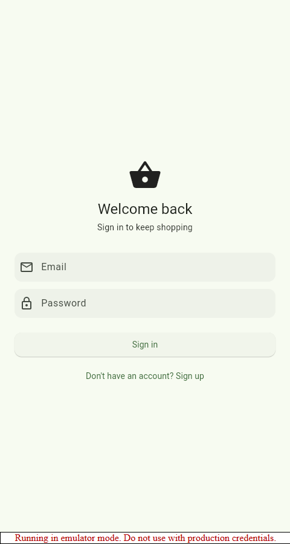
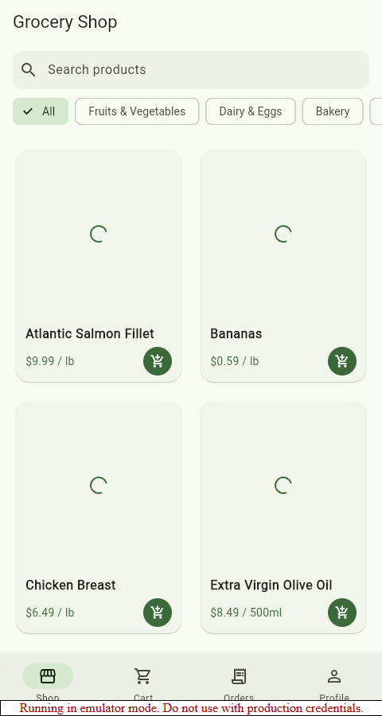
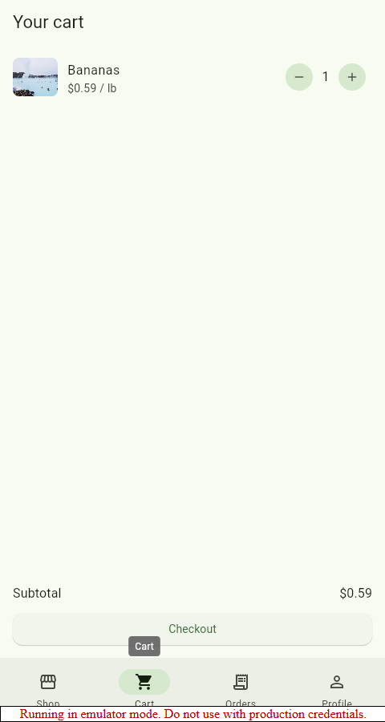
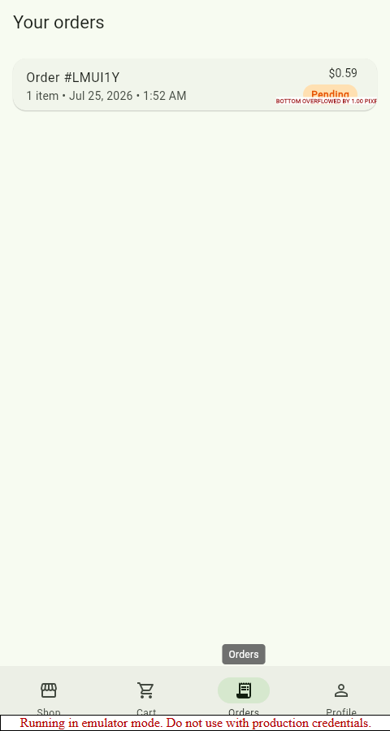

# Grocery Shopping App

A cross-platform grocery shopping app built with Flutter and Firebase: a real-time product catalog, a synced shopping cart, order placement and history, and email/password authentication — structured with clean architecture and backed by Firestore's live listeners rather than manual refresh/polling.

<p align="center">
  
  
  
  
</p>

These screenshots are from an actual run of this codebase against the Firebase Local Emulator Suite (see [Verification](#verification) below) — not mockups.

## Features

- **Real-time product catalog** — browse, search, and filter by category; every screen watching Firestore (`.snapshots()`) updates live if the catalog changes elsewhere, no pull-to-refresh needed.
- **Real-time cart** — add/remove items and adjust quantities; the cart is a Firestore subcollection scoped to the signed-in user and stays in sync across devices/sessions.
- **Order placement and history** — checkout creates an order document and clears the cart in one coordinated flow; the Orders tab watches the user's orders live, including status changes.
- **Email/password authentication** — sign up, sign in, sign out via Firebase Auth, with auth-gated routing (signed-out users can't reach the shop; signed-in users can't land back on the login screen).
- **Material 3 UI** — a single seed-color theme drives light and dark mode across the whole app.

## Architecture

Clean architecture in four layers, each only depending on the one "below" it:

```
lib/
├── domain/           # Pure Dart, no Flutter/Firebase imports
│   ├── entities/         Product, CartItem, Order, AppUser
│   ├── repositories/     Abstract interfaces (contracts only)
│   └── usecases/         Business rules: validation + cross-repository orchestration
├── data/             # Implements the domain's contracts against Firebase
│   ├── models/           Entity subclasses with Firestore (de)serialization
│   ├── datasources/      Thin wrappers around FirebaseAuth / Firestore calls
│   └── repositories/     Implement domain interfaces; translate exceptions to Failures
├── presentation/      # Everything Flutter-widget-facing
│   ├── providers/         ChangeNotifiers exposing state + actions to the UI
│   ├── screens/           One folder per feature (auth, catalog, cart, orders, profile)
│   └── widgets/           Shared, stateless UI components
└── core/              # Cross-cutting: theme, DI, routing, error types, formatting
```

**Use cases vs. direct repository access.** Not every repository method is wrapped in a use case — that would just be ceremony. Read-only real-time streams (`watchProducts`, `watchCart`, `watchOrders`) are consumed directly from repositories by the presentation providers, since there's no business rule to enforce on a plain read. Use cases exist where there's actual logic: `SignInUseCase`/`SignUpUseCase` validate input before touching Firebase; `AddToCartUseCase` enforces stock limits; `PlaceOrderUseCase` orchestrates *two* repositories (creates the order, then clears the cart) — exactly the kind of cross-repository coordination use cases are for.

**Dependency injection** wires the layers together in `core/di/service_locator.dart` using [get_it](https://pub.dev/packages/get_it): Firebase SDK instances → datasources → repositories → use cases → presentation providers, each depending only on the abstraction above it.

**State management** uses [provider](https://pub.dev/packages/provider). `CartProvider` and `OrderProvider` are wired via `ChangeNotifierProxyProvider` so they automatically re-scope to whichever user is currently signed in — sign out and back in as someone else, and you see that user's cart, never the previous one's.

**Routing** uses [go_router](https://pub.dev/packages/go_router) with a `redirect` callback driven by `AuthProvider` (passed as `refreshListenable`): signed-out users are redirected to `/login` from anywhere else, and signed-in users are redirected away from `/login`/`/signup` the instant auth state changes.

## Data model (Firestore)

```
products/{productId}                  — catalog, admin-managed (see firestore.rules)
users/{uid}                            — profile mirror (email, displayName)
carts/{uid}/items/{productId}          — per-user cart subcollection
orders/{orderId}                       — { uid, items[], totalAmount, status, deliveryAddress, createdAt }
```

`firestore.rules` (in the repo root) enforces that:
- any signed-in user can **read** the product catalog, but never write to it (that's an admin/back-office job)
- a cart subcollection is only readable/writable by its owning user
- an order can only be **created** by its own `uid`, and is immutable from the client afterwards — status transitions (`confirmed`, `delivered`, ...) belong to a trusted backend, not the shopper's own device

## Tech stack

| Concern | Choice |
|---|---|
| UI | Flutter, Material 3 |
| Backend | Firebase Auth + Cloud Firestore |
| State management | provider (`ChangeNotifier` / `ChangeNotifierProxyProvider`) |
| Routing | go_router |
| Dependency injection | get_it |
| Local dev/test backend | Firebase Local Emulator Suite |

## Getting started

### Prerequisites

- [Flutter SDK](https://docs.flutter.dev/get-started/install) (3.35+)
- [Node.js](https://nodejs.org/) (for the Firebase CLI via `npx`) and a **JDK 21+** on your `PATH` (the emulators require it — e.g. `firebase-tools` will error on older JDKs)

### 1. Install dependencies

```bash
flutter pub get
```

### 2. Run against the Firebase Local Emulator Suite (default, no account needed)

This project is configured out of the box to run against a **local, fully offline** Firebase backend — no Firebase/GCP project, billing account, or API keys required. `lib/firebase_options.dart` uses a Firebase "demo project ID" (`demo-` prefix), which the emulators treat as offline-only.

```bash
# Terminal 1 — start the emulators
npx firebase-tools emulators:start --only auth,firestore

# Terminal 2 — seed a demo product catalog (one-time per emulator session)
dart run tool/seed_emulator.dart

# Terminal 3 — run the app
flutter run
```

Sign up with any email/password (nothing leaves your machine) and you'll land on a catalog seeded with 16 demo grocery products. The Emulator UI (http://127.0.0.1:4000) lets you inspect Firestore documents and Auth users live while the app runs.

### 3. Running against a real Firebase project instead

1. Create a project in the [Firebase console](https://console.firebase.google.com/), enable **Authentication → Email/Password** and **Firestore**.
2. Run `flutterfire configure` in the project root — it overwrites `lib/firebase_options.dart` with your real project's config.
3. Deploy the security rules: `firebase deploy --only firestore:rules`.
4. Add at least one document to `products` (via the Firebase console, or adapt `tool/seed_emulator.dart`).
5. Run with the emulator connection disabled:
   ```bash
   flutter run --dart-define=USE_FIREBASE_EMULATOR=false
   ```

### Running tests

```bash
flutter test
```

Tests use [fake_cloud_firestore](https://pub.dev/packages/fake_cloud_firestore) and [firebase_auth_mocks](https://pub.dev/packages/firebase_auth_mocks) — in-memory fakes, so the suite needs no emulator or network access. Coverage includes:
- domain use case validation and orchestration rules (e.g. `PlaceOrderUseCase` only clears the cart after a successful order)
- repository behavior against a real (fake, in-memory) Firestore — category filtering, quantity increment-on-repeat-add, per-user cart scoping
- a widget test for the shared `QuantityStepper` component

## Verification

<a id="verification"></a>
This isn't just scaffolding that "should" work — it's been exercised end to end against a real (local) backend:

- `flutter analyze` — zero issues.
- `flutter test` — 26 tests passing (domain use cases, Firestore-backed repositories, a widget test).
- Full manual flow driven against the **Firebase Local Emulator Suite** (real Auth + Firestore, no mocks): sign up → real-time catalog loads from Firestore → add to cart → cart updates live → checkout with a delivery address → cart is cleared and the order appears instantly in Orders with the correct total and "Pending" status → profile shows the correct signed-in user → sign out returns to the login screen. Zero browser console errors throughout.

No user-testing numbers, user counts, or performance benchmarks are reported anywhere in this repo, because none have actually been collected — this has not been tested with real users.

## Project structure

```
grocery-shopping-app/
├── lib/                    # App source (see Architecture above)
├── test/                   # Unit + widget tests
├── tool/seed_emulator.dart # Seeds demo catalog data into the emulator
├── firebase.json           # Emulator ports/config
├── firestore.rules         # Security rules (enforced by the emulator too)
├── firestore.indexes.json  # Composite index for the orders query
└── android/ios/web/windows # Flutter platform scaffolding
```
